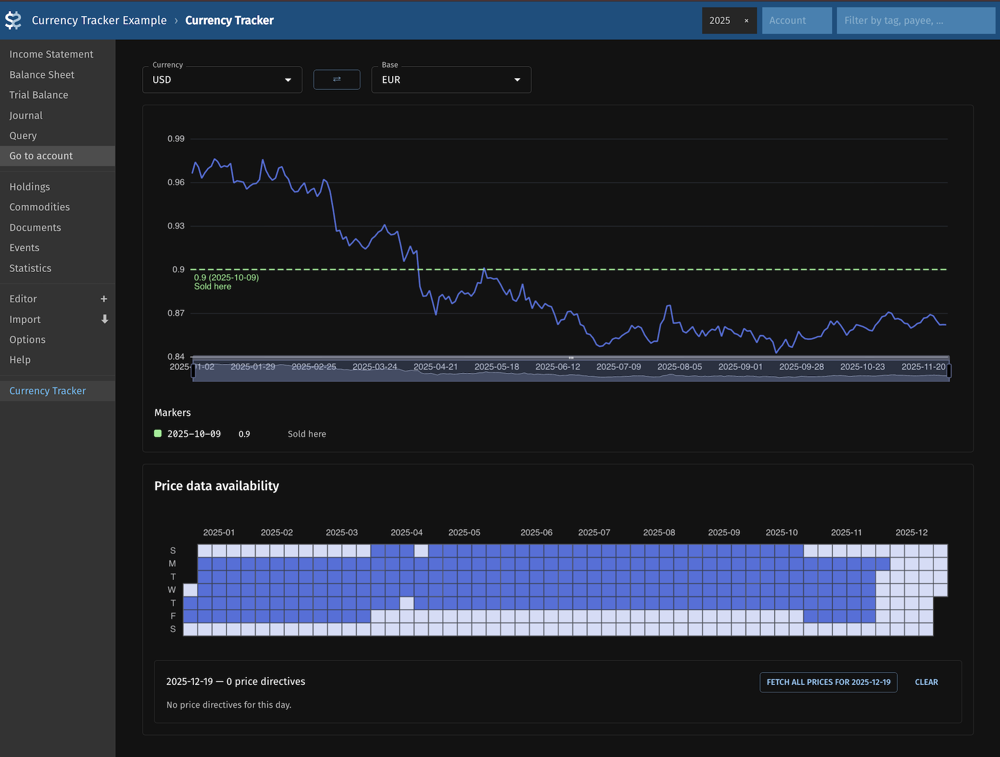

# Fava Currency Tracker

A **[Fava](https://github.com/beancount/fava) extension** for **[Beancount](https://github.com/beancount/beancount)** that provides an interactive dashboard for tracking and managing currency exchange rates.

Track exchange rates over time, visualize data availability, and fetch current prices via [beanprice](https://github.com/beancount/beanprice).



## Features

### 📊 Interactive Currency Dashboard
- **Exchange Rate Chart**: Line graph showing historical exchange rates between selected currencies
- **Data Availability Heatmap**: Calendar view showing availbility of price directives over time
  - Click to view and fetch missing price directives
- **Currency Selection**: Autocomplete selectors for currency and base currency with quick switch button
- Built with React and Apache ECharts

### 💱 Currency Markers
Define visual markers on your exchange rate charts to track target rates:

```beancount
2025-10-01 custom "currency-marker" "EUR" "USD" 1.12 "red" "Target exchange rate"
2025-12-15 custom "currency-marker" "EUR" "USD" 1.18 "goldenrod" "Historical high"
```

### 🔄 Automatic Price Fetching
- Fetch current exchange rates directly from the dashboard (via [beanprice](https://github.com/beancount/beanprice) or [pricehist](https://gitlab.com/chrisberkhout/pricehist) libraries)
- Preview price directives before saving to your ledger
- See [beanprice](https://github.com/beancount/beanprice) for setup details
- Additionally supports `price_fetch_multiplier` metadata on commodity directives
```beancount
2020-01-01 commodity EUR
  price_fetch_multiplier: 0.01
```
for prices that are denominated in a different unit (e.g. cents instead of dollars)

## Installation

Install via pip:

```bash
pip install git+https://github.com/Evernight/fava-currency-tracker.git
```

## Usage

Enable the extension in your Beancount ledger:

```beancount
1970-01-01 custom "fava-extension" "fava_currency_tracker"
```

Then access the Currency Tracker tab in your Fava interface.

## Development

```bash
# Install dependencies
make deps

# Start development server
make dev
```

## See Also
- [fava-portfolio-returns](https://github.com/andreasgerstmayr/fava-portfolio-returns) - Portfolio returns analysis for Fava (referenced for this project)
- [fava-dashboards](https://github.com/andreasgerstmayr/fava-dashboards) - Custom dashboards for Fava (referenced for this project)
- [beanprice](https://github.com/beancount/beanprice) - Price fetching tool for Beancount (used for fetching prices)
- [pricehist](https://gitlab.com/chrisberkhout/pricehist) - Extended price fetching tool with Beancount output format support (used for fetching prices)
- [lazy-beancount](https://github.com/Evernight/lazy-beancount) - Beancount with batteries included (includes this plugin and some more)
